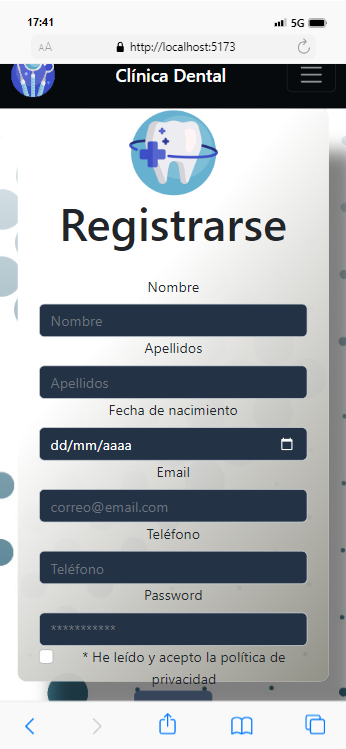

  

<h3 align="center">Clinica-Dental-Frontend</h3>

---

      

## 🧐 About 

Es el diseño funcional Frontend de una cliníca dental, con vistas de login, registro, citas y modificaciondes.

Permite la navegacion de distintas areas segun tu rol Usuario, Admin y Odontologo.

Backend: (https://cesarparada.github.io/Proyecto_Clinica_Dental_Backend/)

### PrevieW

Vista de la navegación de la pagina.

### Instalación

- Clonamos este repositorio.
- Instalamos las dependencias: npm install
- Iniciamos el servidor: npm run dev

## 🎈 Como utilizarlo 

- Nos registramos como usuarios.
- Nos logeamos como usuarios.
- Creamos una cita com usuarios y se nos permite, modificar y eliminar.

## ⛏️ Built Using 

- React.
- Bootstrap.
- HTML.
- CSS - sass.

## ✍️ Authors 

- [@Cesarparada](https://github.com/Cesarparada) - Idea & Initial work

See also the list of [contributors](https://github.com/kylelobo/The-Documentation-Compendium/contributors) who participated in this project.

## Agradecimientos:

Agradezco al profesor:

- **_Prof. Fidel Guilart_**

## Contacto

**_César Parada_**  

